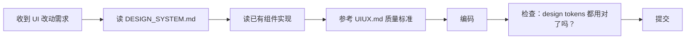

# 设计体系

> 所有 UI 改动必须先读这个文件。不是你做的 UI —— 是项目的 UI。
> 颜色、字体、间距、组件——都在这里定义。不遵守就是改完后还得重改。

---

## 如何使用

1. **首次注入项目时**，把项目的设计 tokens 填入下方占位符
2. **每次做 UI 改动**，打开这个文件，对照参数写代码
3. **设计体系更新**（PM 或设计师改的），同步更新此文件

> 如果有设计技能（如 design-taste-frontend），安装到 `~/.claude/skills/` 并告知 AI 参考此文件。

---

## 设计 Token

### 颜色

| Token | 值 | 用途 |
|---|---|---|
| `--color-primary` | {{COLOR_PRIMARY}} | 主色（操作按钮、链接、选中态） |
| `--color-surface` | {{COLOR_SURFACE}} | 页面背景 |
| `--color-text` | {{COLOR_TEXT}} | 正文文字 |
| `--color-text-secondary` | {{COLOR_TEXT_SECONDARY}} | 次要文字、说明 |
| `--color-border` | {{COLOR_BORDER}} | 边框、分割线 |
| `--color-error` | {{COLOR_ERROR}} | 错误状态、删除操作 |
| `--color-success` | {{COLOR_SUCCESS}} | 成功状态 |
| `--color-warning` | {{COLOR_WARNING}} | 警告状态 |

### 排版

| Token | 值 | 用途 |
|---|---|---|
| `--font-family` | {{FONT_FAMILY}} | 字体栈 |
| `--font-size-base` | {{FONT_SIZE_BASE}} | 正文字号 |
| `--font-size-small` | {{FONT_SIZE_SMALL}} | 辅助文字 |
| `--font-size-h1` | {{FONT_SIZE_H1}} | 一级标题 |
| `--font-size-h2` | {{FONT_SIZE_H2}} | 二级标题 |
| `--font-weight-bold` | `700` | 粗体字重 |

### 间距

| Token | 值 |
|---|---|
| `--space-xs` | {{SPACE_XS}} |
| `--space-sm` | {{SPACE_SM}} |
| `--space-md` | {{SPACE_MD}} |
| `--space-lg` | {{SPACE_LG}} |
| `--space-xl` | {{SPACE_XL}} |

### 圆角

| Token | 值 | 用途 |
|---|---|---|
| `--radius-sm` | {{RADIUS_SM}} | 按钮、输入框 |
| `--radius-md` | {{RADIUS_MD}} | 卡片、弹窗 |
| `--radius-lg` | {{RADIUS_LG}} | 大卡片、模态框 |

---

## UI 改动流程

> 如果跳过了 B（读 DESIGN_SYSTEM.md），大概率写出来的 UI 和项目不搭，需要重改。

---

## 参考资源

- [UIUX.md](UIUX.md) — UI/UX 通用质量标准
- 设计技能（推荐安装到全局）：
  - `design-taste-frontend` — 高质量前端设计技能
  - `minimalist-ui` — 极简风格前端技能
